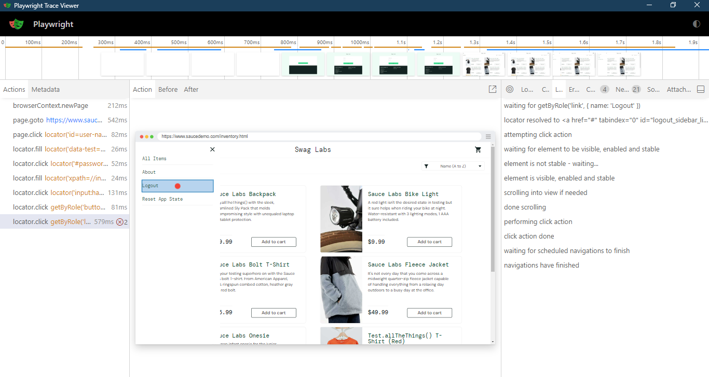

# PLaywright Automation Testing

This project showcases the fundamentals of Playwright automation testing: 
- test, expect, browser, context, page, hooks, selectors, locators, getByRole etc
- traceviewer, codegen etc

## Screenshots

 